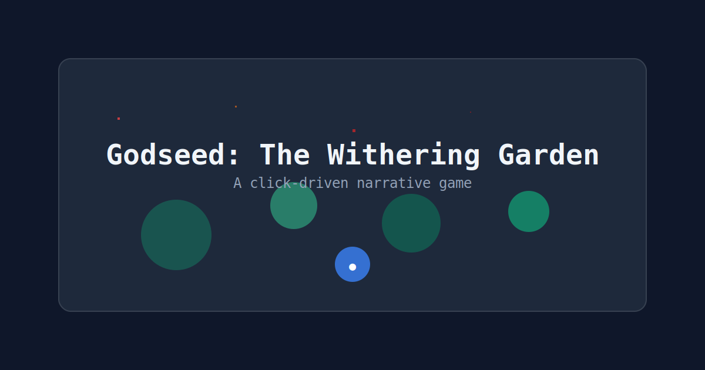

# Godseed: The Withering Garden

A click-driven narrative game about a withering garden. Plant, awaken, and watch as entropy consumes your digital garden.

## Container-First Development

This project is designed to run entirely in Docker containers. No local Node.js installation required.

### Quick Start

```bash
# Start development server
make dev

# Run tests
make test

# Run E2E tests
make e2e

# Build for production
make build

# Start production server
make prod

# Stop all services
make down
```

### Development Commands

- `make dev` - Start development server with hot reload (Docker)
- `make test` - Run unit tests (Docker)
- `make e2e` - Run E2E tests (Docker)
- `make build` - Build for production (Docker)
- `make prod` - Start production server (Docker)
- `make down` - Stop all services
- `make clean` - Clean up Docker resources

### Docker-Only Development

This project is designed to run entirely in Docker containers. All dependencies are installed inside the containers, so no local Node.js installation is required.

```bash
# All development happens in containers
make dev    # Development server
make test   # Unit tests  
make e2e    # E2E tests
make build  # Production build
make prod   # Production server
```

## Docker Services

The project uses Docker Compose with profiles:

- **dev**: Development server with hot reload
- **test**: Unit testing with Vitest
- **e2e**: End-to-end testing with Playwright
- **build**: Production build
- **prod**: Production server with Nginx

## Game Features

- **Click-driven narrative**: Advance the story with clicks or keyboard
- **Domain alignments**: Choose between FLESH, STONE, ASH, and DREAM
- **Entropy system**: Rapid clicking increases chaos and corruption
- **Save system**: Three save slots with import/export functionality
- **Horror narrative**: 150+ lines of atmospheric text with branching paths
- **Atmosphere system**: Entropy-driven audio & visual effects
- **Accessibility**: Keyboard navigation, reduced motion, and audio controls

## Atmosphere System

The game features a comprehensive entropy-driven atmosphere system that reacts to your actions:

### Audio Cues
- **Ambient drones**: Low/mid frequency loops that shift with entropy levels
- **Static noise**: High entropy (60+) triggers hiss and interference
- **Story events**: Seed flags trigger glass chimes, awaken flags trigger bells
- **Corruption tags**: Text with `[loud]` triggers heartbeat, `[soft]` triggers chimes
- **Choice ducking**: UI interactions temporarily reduce ambient volume

### Visual Effects
- **Shimmer**: Subtle color shifts at 40+ entropy
- **Flicker**: Screen brightness fluctuations at 60+ entropy  
- **Intense flicker**: Rapid visual corruption at 80+ entropy
- **Seizure effects**: Brief whiteout and scanlines at 90+ entropy
- **Text corruption**: Corruption lines get visual rift effects
- **UI bloom**: Choice menus trigger bloom pulse effects

### Accessibility
- **Mute toggle**: Disable all audio while keeping visual effects
- **Volume control**: Master volume slider (0-100%)
- **Reduce motion**: Disable intense visual effects for accessibility
- **Keyboard navigation**: Full game control without mouse

### Loop Metadata System

The game features an automatic loop detection system that analyzes audio assets for seamless looping:

#### **Automatic Analysis**
- **Build-time generation**: `npm run build:loops` analyzes all audio assets
- **Cross-correlation detection**: Finds optimal loop points using signal analysis
- **Smart classification**: Distinguishes between loopable drones and one-shot effects
- **Fallback handling**: Graceful degradation when analysis fails

#### **Runtime Integration**
- **Seamless loops**: Ambient drones loop with imperceptible transitions
- **Crossfading**: Smooth transitions between entropy levels
- **Debug visualization**: HUD debug panel shows active loops and metadata
- **Performance optimized**: Loop points calculated once at build time

#### **Developer Tools**
- **CLI analysis**: `npm run analyze:loop path/to/file.wav` for individual files
- **Debug panel**: Real-time loop visualization in HUD
- **Metadata inspection**: View loop points, confidence scores, and crossfade timing
- **Test mode**: DOM attributes for E2E testing verification

### Troubleshooting
- **Autoplay policies**: Audio requires user interaction to start
- **Performance**: Effects automatically disable on low-end devices
- **Browser compatibility**: Uses Web Audio API with graceful fallbacks
- **Loop metadata**: Missing `dist/loop_meta.json` uses fallback values
- **Audio analysis**: Failed analysis falls back to full-buffer looping

## GitHub Pages Deployment

The project is configured for automatic deployment to GitHub Pages:

1. Push to `main` branch
2. GitHub Actions will automatically build and deploy
3. Set `BASE_PATH` repository variable to `/godseed-withering-garden/` if needed

## Configuration

### Base Path

The app supports different base paths for deployment:

- Development: `/` (default)
- GitHub Pages: `/godseed-withering-garden/` (set via `BASE_PATH` environment variable)

### Environment Variables

- `BASE_PATH` - Base path for the application (default: `/`)

## Accessibility

- Space/Enter keys advance the story
- Respects `prefers-reduced-motion` for animations
- Keyboard navigation support
- Screen reader friendly

## Architecture

The game uses a simple but effective architecture:

- **React + TypeScript** - Modern UI framework
- **Zustand** - Lightweight state management
- **Tailwind CSS** - Utility-first styling
- **Vite** - Fast build tool and dev server
- **Vitest** - Testing framework
- **Story Engine** - Custom narrative system with entropy effects

### Key Components

- `ClickSurface` - Main interaction area
- `HUD` - Game status display (seeds, awakened, entropy)
- `LogPane` - Story history with typewriter effects
- `StoryEngine` - Narrative logic and entropy system

## Contributing

1. Fork the repository
2. Create a feature branch
3. Make your changes
4. Run tests and linting
5. Submit a pull request

## License

MIT License - see [LICENSE](LICENSE) file for details.

## Screenshots



*The garden awaits your touch...*